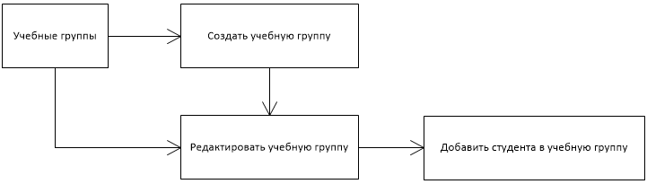

# Тестовое задание

Задание

1. Создать в SQL Server базу данных для хранения данных.
2. Добавить несколько тестовых значений в таблицы Преподаватель, Организация, Сотрудник, Курс. Страницы для управления данными в этих таблицах делать не нужно.
3. Разработать функционал для управления Учебными группами с помощью ASP.NET MVC (любая версия и движок отображения). Страницы не требуют визуального дизайна, только структурный, соответствующий макетам. Доступ к БД с помощью ORM (Entity Framework, NHibernate, BLToolkit либо другие)

Модель данных

Страницы

1. Учебные группы
2. Создание учебной группы
3. Редактирование учебной группы
4. Добавление студента в учебную группу

Логика перехода по страницам

Основной сценарий

1. Администратор заходит на страницу «Учебные группы» и нажимает кнопку «Создать учебную группу».
2. Система переходит на страницу «Создать учебную группу».
3. Администратор заполняет поля «Преподаватель», «Название учебной группы» и нажимает кнопку «Создать учебную группу».
4. Система сохраняет информацию об учебной группе в базе данных и переходит на страницу «Редактирование учебной группы».
5. Администратор нажимает кнопку «Добавить студента».
6. Система переходит на страницу «Добавить студента в учебную группу» и выводит список привязанных к преподавателю организаций.
7. Администратор заполняет поле организация «Организация»
8. Система выводит список сотрудников в данной организации еще не включенных в данную группу.
9. Администратор выбирает конкретного «Сотрудника» и нажимает кнопку «Добавить студента в учебную группу».
10. Система сохраняет изменения в базе данных и переходит на страницу «Редактировать учебную группу».

Макет страницы "Учебные группы"

Макет страницы «Создать учебную группу»

Макет страницы «Редактировать учебную группу»

Макет страницы «Добавить студента в учебную группу»

